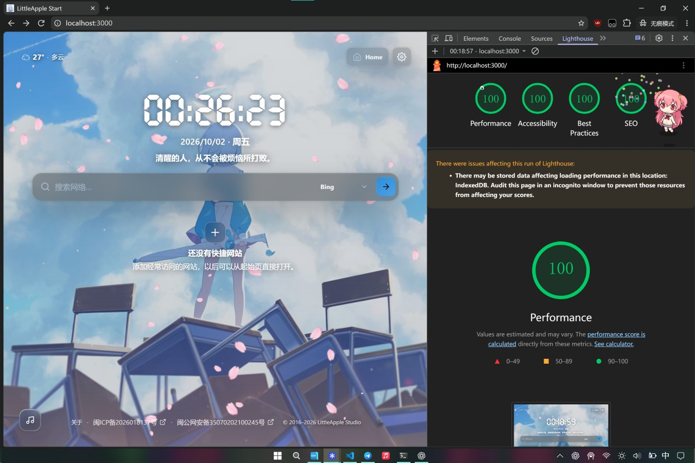

# LittleApple Start Community Edition

> 新标签页，现在由你掌控。

[DEMO](https://start.nekro.top/) | [English](README_EN.md)

**LittleApple Start Community Edition** 是基于 [小苹果起始页 4.8](https://www.littleapple.top/startweb.html) 改进的浏览器起始页。项目遵循本地配置优先（Local-first）的原则，主打高度自由的视觉定制与界面构图，适合用作浏览器首页或新标签页。

## 界面预览



## 核心特性

### 外观配置

 * 个性化壁纸：支持图片与视频背景，提供填充、适应、拉伸、平铺及居中等多种布局方式。
 * 细节微调：可自定义壁纸焦点、遮罩透明度、模糊强度以及樱花飘落等特效。
 * 色彩提取与强调色：内置预设配色，能自动提取自定义图片的调性，也支持手动指定强调色。
 * 界面材质与主题：内置浅色/深色模式（支持跟随系统切换），提供简洁、标准玻璃及液态玻璃（默认）三种材质。
 * 灵活布局：支持调整整体/模块比例、间距以及界面元素的位置构图。

### 功能模块

 * 时钟与日期：支持多时区、12/24小时制、秒数显示及多种日期格式。
 * 搜索与聚合：内置搜索引擎管理、自定义默认搜索引擎及联想词补全。
 * 快捷链接与操作：支持自定义 Quick Links（带图标排序与首字母降级兜底）和顶部固定操作入口（Top Actions）。
 * 专注模式：一键隐藏界面多余元素，纯享背景视觉。
 * 一言与天气：默认集成 Hitokoto API（带离线兜底），可选集成 Open-Meteo 天气预报。
 * 音乐播放：支持独立背景音频（本地存储）以及 APlayer 播放器（支持网络音频、封面及 LRC 歌词）。APlayer 可选使用实验性的 Meting 集成，按歌曲、播放列表、专辑、搜索或艺术家解析曲目。
 * 页脚设置：支持自定义版权文本及 ICP/公安备案信息显示。

## 技术栈

 * 框架与语言：Next.js 16 (App Router) / React 19 / TypeScript
 * 样式与 UI：Tailwind CSS 4 + CSS Variables / Feather Icons / liquid-glass
 * 交互与存储：dnd-kit / IndexedDB + LocalStorage / APlayer
 * 测试与规范：Vitest / ESLint

## 部署

> 本项目无需服务端数据库。可选的部署运行时环境变量只用于新用户默认值与重置，不会覆盖已有用户配置；用户配置及媒体文件仍直接存储在浏览器中。

### 使用 Vercel 部署 (推荐)

1. 将仓库导入 [Vercel](https://vercel.com/)。
2. Framework Preset 选择 Next.js，或使用自动识别结果。
3. 构建配置保持默认 (Install Command 使用 `npm install`, Build Command 使用 `npm run build`)。
4. 部署后打开分配的域名即可。

### 使用 Docker 手动部署

> 项目基于 Next.js standalone 生产镜像构建 (Node 24 Alpine)，在端口 3000 运行。

```bash
docker build -t littleapple-start .
docker run --rm -p 3000:3000 littleapple-start
```

> 运行后访问 `http://localhost:3000` 即可。

### 部署默认值（可选）

可在 Docker 环境变量或 Vercel Project Environment Variables 中设置以下公开默认值。未设置或为空时保留内置默认；这些值只用于首次初始化和重置，已有配置及导入的 `.littleapple` 配置优先。

```yaml
environment:
  LITTLEAPPLE_DEFAULT_SITE_NAME: "My Start"
  LITTLEAPPLE_DEFAULT_BACKGROUND_URL: "https://example.com/background.webp"
  LITTLEAPPLE_DEFAULT_FAVICON_URL: "https://example.com/favicon.png"
  LITTLEAPPLE_DEFAULT_ICP_ENABLED: "false"
  LITTLEAPPLE_DEFAULT_POLICE_ENABLED: "false"
  LITTLEAPPLE_DEFAULT_COPYRIGHT_ENABLED: "true"
  LITTLEAPPLE_DEFAULT_COPYRIGHT_TEXT: "© 2026 My Site"
```

支持的参数还包括：`LITTLEAPPLE_DEFAULT_ICP_TEXT`、`LITTLEAPPLE_DEFAULT_ICP_URL`、`LITTLEAPPLE_DEFAULT_POLICE_TEXT`、`LITTLEAPPLE_DEFAULT_POLICE_URL`。布尔值支持 `true`/`false`（也兼容 `1`/`0`）。用户自定义 Logo 的 favicon 优先级高于部署 favicon。

### 本地开发与调试

> 推荐使用 Node.js 24。

```bash
npm install
npm run dev
```

### 构建与质量检查：

```bash
npm run typecheck
npm run lint
npm run test
npm run build
npm run start
```

## 设置项说明

> 设置面板含五个分类：

 * 外观：壁纸/背景视频、背景音频、特效、主题模式、材质、色彩提取与自定义调色、布局构图与间距。
 * 链接：默认搜索引擎、引擎列表管理、快捷链接与顶部操作的排序及图标配置。
 * 内容：站点名称与 Logo、时钟格式、一言源、天气位置、专注模式、动画开关、页脚及 APlayer 播放列表。
 * 数据：备份导入与导出（.littleapple）、重置设置、本地数据管理与旧版配置迁移。
 * 关于：版本信息（v5.0）、项目相关链接、开源协议与致谢。

## 数据与隐私

### 数据存储

 * 项目采用 Local-first 架构，绝大部分数据均保存在本地。
 * 轻量配置：存储在 localStorage（Key: littleapple.config.v4）。
 * 媒体资源：上传的图片/视频壁纸、背景音频与自定义 Logo 存储在 IndexedDB（数据库名 LittleAppleStart，表名 assets）。
 * 备份导出：生成的 .littleapple 文件包含当前配置与本地媒体资源，用于手动迁移，不涉及任何云端备份。
 * 服务端（Vercel 或 Docker）不会收集或上传用户的任何配置与媒体资源。清理浏览器缓存会导致本地存储的数据丢失。

### 外发网络请求

> 第三方服务的可用性和 CORS 由其自身决定。浏览器自动播放策略可能要求用户先与页面交互。

在默认状态下，页面仅在以下情况发起网络请求：

 * 校准网络时间（获取自 time.akamai.com，可在设置中切换为本机时间）。
 * 获取一言语句（请求自 v1.hitokoto.cn，失败时使用本地预设）。

仅当用户手动开启或配置对应功能时，会触发以下请求：

 * Open-Meteo 天气数据查询。
 * 用户自定义的一言/天气 API。
 * APlayer 播放器获取音频、封面与歌词。
 * 用户配置的 Meting API 获取解析后的歌曲、封面与歌词。
 * 获取第三方 Quick Link 图标。

## 版本说明

> LittleApple Start Community Edition 是基于小苹果起始页 4.8 二次开发的开源版本，已获得原作者（LittleApple Studio / 小苹果工作室）授权发布。

 * 本项目完全面向社区开源与独立部署使用，虽继承了小苹果起始页的核心设计与功能，但预设资源与服务集成均与原版有所差异。
 * 请注意：本项目为社区独立维护，请勿向小苹果工作室提交任何关于本项目的反馈。再次感谢小苹果工作室对本项目开发的支持。

## 许可协议

LittleApple Start Community Edition 遵循 **MIT License** 开源协议，详情请参阅 [LICENSE](LICENSE) 文件。

第三方组件致谢：

 * `@samasante/liquid-glass` — MIT
 * `@DIYgod/APlayer` — MIT
 * `@hitokoto-osc/hitokoto-api` — Apache-2.0
